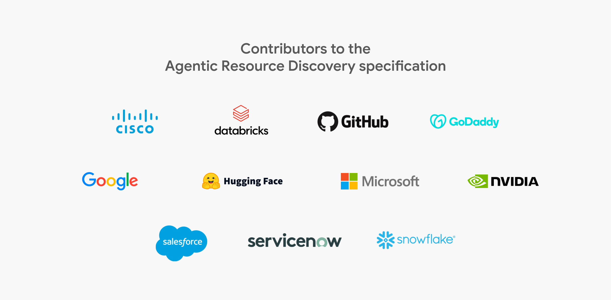

# Contributors

ARD is being designed, reviewed, and supported by agent builders at:

- Cisco
- Databricks
- GitHub
- GoDaddy
- Google
- Hugging Face
- Microsoft
- Nvidia
- Salesforce
- ServiceNow
- Snowflake

All of you are building agents, tools, Skills, and more. We encourage you to add support for AI Catalog and ARD — see our [How to publish](how_to_publish.md) guide.

{ .logo-wall }

## Acknowledgements

We thank the following people for their contributions and feedback, in alphabetical order.

- Amazon Web Services — Jeffrey Damick, Martin Ristov
- Cisco — Guillaume De Saint Marc, Karen Jaworski, Luca Muscariello, Ramiz Polic, Vijoy Pandey
- Databricks — Jonathan Keller, Vinod Marur
- GitHub — Evan Boyle, Jeremy Moseley, Meagan Cojocar, Trent Jones
- GoDaddy — Scott Courtney
- Google — Alan Blount, Ines David, John Murray, Krishna Thota, Natasha Balasubramanian, Polong Lin, Rao Surapaneni, Sam Sharaf, Sampath Kumar Maddula, Srinivas Krishnan, Todd Segal
- Microsoft — Adam Zukor, Chelsea Carter, Dee Templeton, Jennifer Marsman, Kevin Scott, Lindsey Li, Lisa Jaloza, Miesha Baker, Ryan Nadel, Shelby Delano
- Nvidia — Aysen Ilkhabar
- Salesforce — Mariano Gonzales, Vijay Pandiarajan
- Snowflake — Baris Gultekin, Vivek Raghunathan
